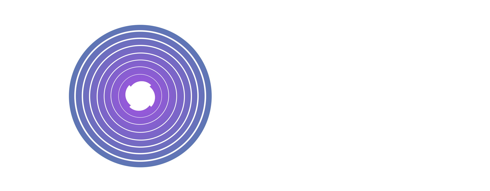

<h3 align="center">AI Game Sound Effects library with 140+ sounds!</h3>

GMSFX3 - Wrapper for the <a href="https://github.com/xzripper/gmsfx3-sounds">gmsfx3-sounds</a> sound base, containing 140+ sound effects.  
Currently supported languages:
  * Python (#1 Support).
  * Java (#1 Support).
  * Lua (#2 Support).

More coming...

<h3>SFX tree for sound base version <code>06.05.2024</code>.</h3>

  
SFX Tree (long).
 

  - `Ambiance`
    - `Dark`
      - `AMBIENCE_DARK_1`
      - `AMBIENCE_DARK_2`
      - `AMBIENCE_DARK_3`
      - `AMBIENCE_DARK_4`
      - `AMBIENCE_DARK_5`
    - `FarHowlingWind`
      - `AMBIENCE_FAR_HOWLING_WIND_1`
      - `AMBIENCE_FAR_HOWLING_WIND_2`
      - `AMBIENCE_FAR_HOWLING_WIND_3`
      - `AMBIENCE_FAR_HOWLING_WIND_4`
      - `AMBIENCE_FAR_HOWLING_WIND_5`
    - `Forest`
      - `AMBIENCE_FOREST_1`
      - `AMBIENCE_FOREST_2`
      - `AMBIENCE_FOREST_3`
      - `AMBIENCE_FOREST_4`
      - `AMBIENCE_FOREST_5`
    - `HowlingWind`
      - `AMBIENCE_HOWLING_WIND_1`
      - `AMBIENCE_HOWLING_WIND_2`
    - `Night`
      - `AMBIENCE_NIGHT_1`
      - `AMBIENCE_NIGHT_2`

  - `Beep`
    - `BEEP_1`
    - `BEEP_2`
    - `BEEP_3`

  - `Breathe`
    - `BREATHE_1`

  - `Closing`
    - `Closet`
      - `CLOSING_CLOSET_1`
    - `Door`
      - `CLOSING_DOOR_1`
    - `Lattice`
      - `CLOSING_LATTICE_1`
    - `Shelf`
      - `CLOSING_SHELF_1`

  - `Crow`
    - `CROW_1`
    - `CROW_2`
    - `CROW_3`
    - `CROW_4`

  - `Crowd`
    - `CROWD_1`
    - `CROWD_2`

  - `Ding`
    - `DING_1`

  - `Explosion`
    - `Big`
      - `EXPLOSION_BIG_1`
      - `EXPLOSION_BIG_2`
      - `EXPLOSION_BIG_3`
      - `EXPLOSION_BIG_4`
      - `EXPLOSION_BIG_5`
    - `Small`
      - `EXPLOSION_SMALL_1`
      - `EXPLOSION_SMALL_2`
      - `EXPLOSION_SMALL_3`
      - `EXPLOSION_SMALL_4`

  - `FallenObject`
    - `GlassVase`
      - `FALLEN_OBJECT_GLASS_VASE_1`
    - `HumanBody`
      - `FALLEN_OBJECT_HUMAN_BODY_1`
      - `FALLEN_OBJECT_HUMAN_BODY_2`
      - `FALLEN_OBJECT_HUMAN_BODY_3`
    - `MetalThing`
      - `FALLEN_OBJECT_METAL_THING_1`
      - `FALLEN_OBJECT_METAL_THING_2`
    - `Plank`
      - `FALLEN_OBJECT_PLANK_1`
    - `Wood`
      - `FALLEN_OBJECT_WOOD_1`
      - `FALLEN_OBJECT_WOOD_2`

  - `FarHeliFlyBy`
    - `FAR_HELI_FLY_BY_1`

  - `FarJetFlyBy`
    - `FAR_JET_FLY_BY_1`
    - `FAR_JET_FLY_BY_2`
    - `FAR_JET_FLY_BY_3`
    - `FAR_JET_FLY_BY_4`

  - `FemaleHit`
    - `FEMALE_HIT_1`
    - `FEMALE_HIT_2`

  - `FemaleOuch`
    - `FEMALE_OUCH_1`
    - `FEMALE_OUCH_2`

  - `FireBoom`
    - `FIRE_BOOM_1`
    - `FIRE_BOOM_2`
    - `FIRE_BOOM_3`
    - `FIRE_BOOM_4`

  - `Footstep`
    - `Branch`
      - `FOOTSTEP_BRANCH_1`
      - `FOOTSTEP_BRANCH_2`
      - `FOOTSTEP_BRANCH_3`
      - `FOOTSTEP_BRANCH_4`
    - `Concrete`
      - `FOOTSTEP_CONCRETE_1`
      - `FOOTSTEP_CONCRETE_2`
      - `FOOTSTEP_CONCRETE_3`
    - `Grass`
      - `FOOTSTEP_GRASS_1`
      - `FOOTSTEP_GRASS_2`
    - `Gravel`
      - `FOOTSTEP_GRAVEL_1`
      - `FOOTSTEP_GRAVEL_2`
      - `FOOTSTEP_GRAVEL_3`
      - `FOOTSTEP_GRAVEL_4`
    - `Sand`
      - `FOOTSTEP_SAND_1`
      - `FOOTSTEP_SAND_2`
    - `Water`
      - `FOOTSTEP_WATER_1`
    - `Wood`
      - `FOOTSTEP_WOOD_1`
      - `FOOTSTEP_WOOD_2`

  - `GlassBreaks`
    - `GLASS_BREAKS_1`
    - `GLASS_BREAKS_2`
    - `GLASS_BREAKS_3`
    - `GLASS_BREAKS_4`

  - `GMSFX3Intro`
    - `GMSFX3_INTRO_1`
    - `GMSFX3_INTRO_2`
    - `GMSFX3_INTRO_3`

  - `Gun`
    - `Blaster`
      - `GUN_BLASTER_SHOT_1`
      - `GUN_BLASTER_SHOT_2`
      - `GUN_BLASTER_SHOT_3`
      - `GUN_BLASTER_SHOT_4`
    - `Pistol`
      - `GUN_PISTOL_SHOT_1`
      - `GUN_PISTOL_SHOT_2`
      - `GUN_PISTOL_SHOT_3`
      - `GUN_PISTOL_SHOT_4`
    - `Rifle`
      - `GUN_RIFLE_SHOT_1`
      - `GUN_RIFLE_SHOT_2`
      - `GUN_RIFLE_SHOT_3`

  - `Human`
    - `HUMAN_BREATHING_1`

  - `Knife`
    - `KNIFE_BLADE_1`

  - `MaleHit`
    - `MALE_HIT_1`
    - `MALE_HIT_2`

  - `MaleOuch`
    - `MALE_OUCH_1`
    - `MALE_OUCH_2`

  - `Mechanical`
    - `Beep`
      - `MECHANICAL_BEEP_1`
      - `MECHANICAL_BEEP_2`
    - `Success`
      - `MECHANICAL_SUCCESS_1`

  - `Meow`
    - `MEOW_1`

  - `Opening`
    - `ClosenDoor`
      - `OPENING_CLOSEN_DOOR_1`
    - `Closet`
      - `OPENING_CLOSET_1`
      - `OPENING_CLOSET_2`
    - `Door`
      - `OPENING_DOOR_1`
      - `OPENING_DOOR_2`
    - `Shelf`
      - `OPENING_SHELF_1`

  - `PoliceSiren`
    - `Far`
      - `POLICE_SIREN_FAR_1`
    - `NearFar`
      - `POLICE_SIREN_NEAR_FAR_1`
    - `Stop`
      - `POLICE_SIREN_STOP_1`

  - `PoweredGMSFX3`
    - `POWERED_GMSFX3`

  - `SeaAmbience`
    - `SEA_AMBIENCE_1`
    - `SEA_AMBIENCE_2`
    - `SEA_AMBIENCE_3`
    - `SEA_AMBIENCE_4`
    - `SEA_AMBIENCE_5`

  - `Sirens`
    - `SIRENS_1`
    - `Ambient`
      - `SIRENS_AMBIENT_1`
      - `SIRENS_AMBIENT_2`
    - `Chaos`
      - `SIRENS_CHAOS_1`
    - `GettingFar`
      - `SIRENS_GETTING_FAR_1`

  - `Teleport`
    - `TELEPORT_1`
    - `TELEPORT_2`

  - `Train`
    - `Horn`
      - `TRAIN_HORN_1`
      - `TRAIN_HORN_2`
      - `TRAIN_HORN_3`

  - `TreesAffectedByWind`
    - `TREES_AFFECTED_BY_WIND_1`

  - `Vehicle`
    - `Door`
      - `Close`
        - `VEHICLE_DOOR_CLOSE_1`
        - `VEHICLE_DOOR_CLOSE_2`
      - `Open`
        - `VEHICLE_DOOR_OPEN_1`
        - `VEHICLE_DOOR_OPEN_2`
    - `Driving`
      - `VEHICLE_DRIVING_INSIDE_1`
    - `Engine`
      - `Running`
        - `Inside`
          - `VEHICLE_ENGINE_RUNNING_INSIDE_1`
        - `Outside`
          - `VEHICLE_ENGINE_RUNNING_OUTSIDE_1`
      - `Start`
        - `VEHICLE_ENGINE_START_1`
    - `PassingBy`
      - `VEHICLE_PASSING_BY_1`

<h3>Wrapper Documentation (Python version, but applicable for every language).</h3>

  
Wrapper documentation.

  `__init__`: 
    - `gmsfx3_sfx_url(sfxname: SFXName) -> str`: Generate SFX URL. Used by `gmsfx3_get` and probably you don't need this.  
    - `gmsfx3_get(sfxname: SFXName) -> GMSFX3DownloadResult`: Download SFX. In the event of a successful outcome, the path to SFX will be returned. In the absence of a successful outcome, a tuple will be returned along with an error message and an incorrect URL.  
    - `gmsfx3_clear_cached_sfx() -> None`: This function clears the cached SFX, but you lose access to them next time. Download SFX via `gmsfx3_get` again next time.  
    - `gmsfx3_version() -> str`:  Get `GMSFX3` version.  
    - `gmsfx3_sounds_base_version() -> str`: Get `gmsfx3-sounds` base version.  

  `sfxlist`: 
    - `class GMSFX3`: 
      - SFX Tree... Look up for SFX tree. 

<h3>Contribution.</h3>
You can push issue for new sound request, or for any other issue. Pull requests for implementing new wrappers are welcomed.

<h3>License.</h3>

`gmsfx3-sounds` base has no copyrighted material and free to use.  
The `GMSFX3` software is licensed under the MIT License, but I would like to request that you include an attribution.

<b>GMSFX3 v1.1.0</b> 

